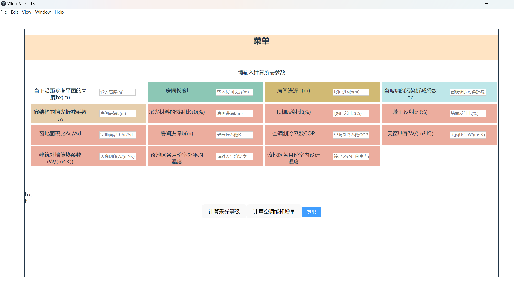

# 采光及能耗评估软件
daylighting-energy-assessment

## 项目构建
### 运行
安装依赖库
`npm install`

运行
`npm run dev`
### 打包
切记打包之前把electron/index.ts修改env，pro为开发环境
使用forge打包

```
npm run build

npm i -D @electron-forge/cli

npx electron-forge import

npm run package
```
打包之后的文件在out目录下，用这种方式生产的exe文件
## 项目截图
